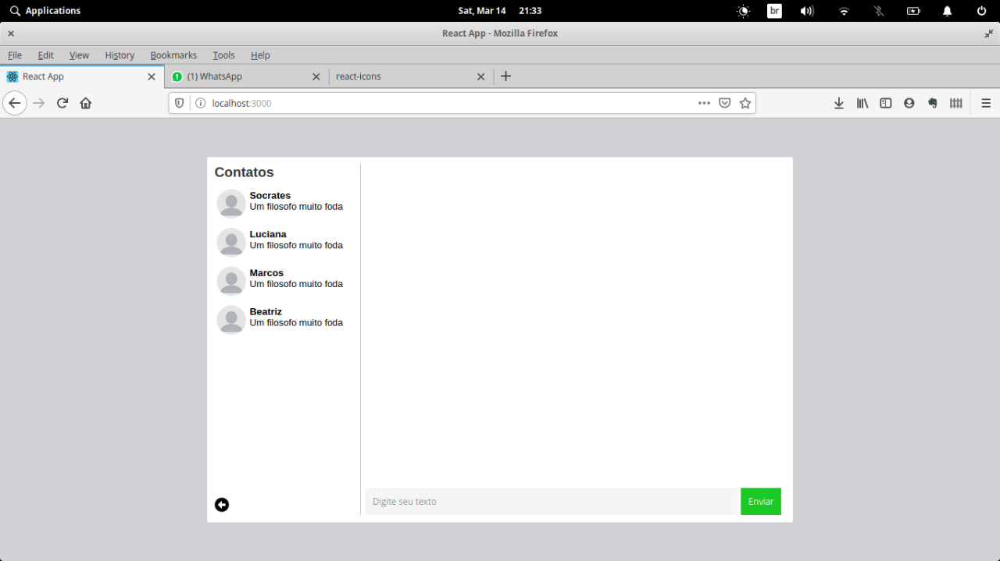

# Chat app clone
- [API](https://github.com/felipehfs/chat-backend)

A simple chat using golang, React and websockets

# Requirements
- Nodejs.
- Docker compose installed.

# Dependencies
- Reactjs
- axios
- react-router-dom